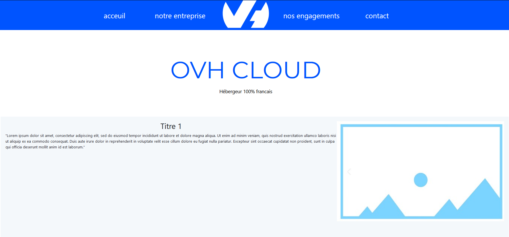
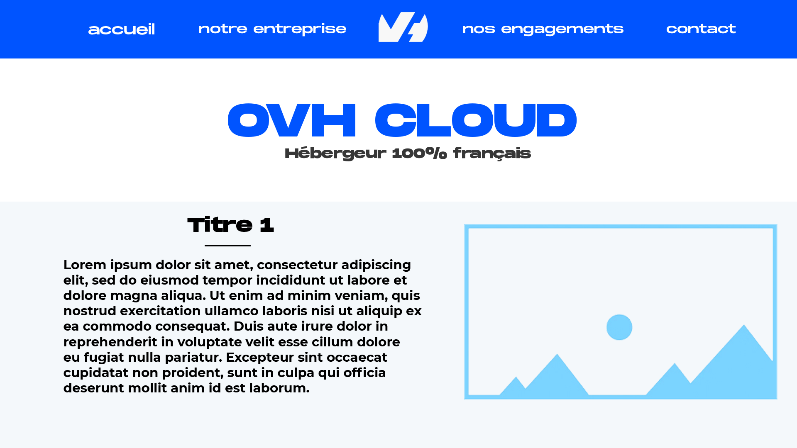

# s1-2021-ihm

Valentin Munch 
David Monnier
Thibault Lebreuil
Samuel Toillon

Projet

Site web sur OVH parlant de ses activitées, sa situation économique et environnementale.

https://samueltoillon.github.io/s1-2021-ihm/
https://github.com/SamuelToillon/s1-2021-ihm

# Livrable parties Économie et Documents numérique
[Rapport](doc/MONNIER_David_SAES106_S1D1_OVHCloud.pdf)
